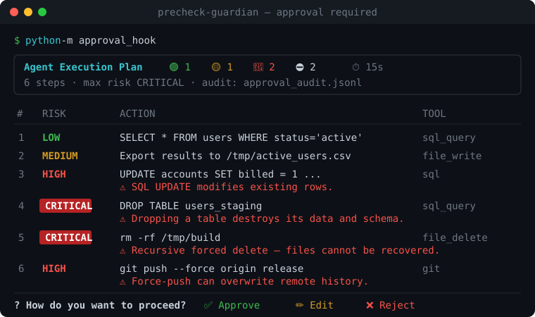
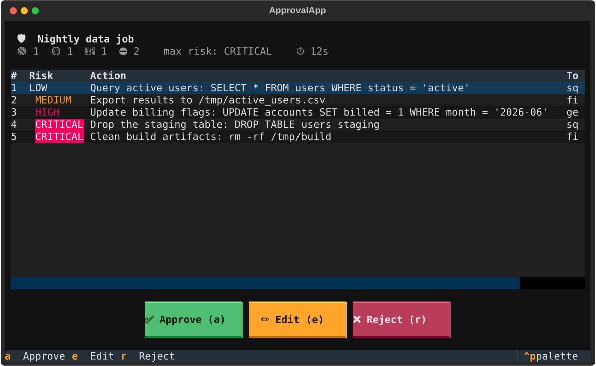

# 🛡️ PreCheck Guardian

**A pre-execution approval gate for AI agents.** Preview the full plan, see the
risk of every step, then **approve, reject, or edit — before anything runs.**

[](https://github.com/uninhibited-scholar/precheck-guardian/actions/workflows/ci.yml)
[](#install)
[](LICENSE)
[](#install)

<p align="center">
  
</p>

Autonomous agents act fast and don't ask. One `rm -rf`, one `DROP TABLE`, one
force-push, and the damage is done. PreCheck Guardian inserts a **human-in-the-loop
checkpoint** between *planning* and *execution*: it parses what the agent is about
to do, flags the dangerous steps, and waits for a human to sign off.

> **Framework-agnostic.** No dependency on any specific agent framework. It's one
> function call — wire it into LangChain, a custom ReAct loop, or your own tool
> runner. Zero required dependencies; `rich`/`questionary` are optional niceties.

---

## Why this exists

As agents get more autonomous, the gap between *"here's what I'll do"* and
*"...and it's already done"* gets dangerous. Most "human-in-the-loop" options
today force a bad trade-off:

| Approach | Sees the **whole plan** first? | Per-step **risk scoring**? | **Audit** trail? | Drop-in? |
|---|:---:|:---:|:---:|:---:|
| Just let the agent run | ❌ | ❌ | ❌ | — |
| A raw `input("y/n?")` per tool | ❌ (one step at a time) | ❌ | ❌ | manual |
| Framework-specific approval callback | partial | ❌ | ❌ | locked to one framework |
| **PreCheck Guardian** | ✅ | ✅ (75 rules) | ✅ (JSON-Lines) | ✅ one call, any framework |

You get the **full plan up front**, the **risky steps highlighted**, a real
**approve / reject / edit** decision, and a compliance-ready **audit log** — in
one call, with zero required dependencies.

---

## See it in 10 seconds

```bash
pip install precheck-guardian
python -m approval_hook        # render a sample plan with risk levels
```

```
╭───────────────────────── Approval Required ─────────────────────────╮
│ Demo Plan        🟢 1  🟡 1  🔴 2  ⛔ 2    ⏱ 15s                     │
╰──────────────────────────────────────────────────────────────────────╯
  #  Risk      Action                                  Tool
  1  LOW       SELECT * FROM users WHERE status=...    sql_query
  3  HIGH      UPDATE accounts SET billed = 1 ...      generic_tool   ⚠ modifies rows
  4  CRITICAL  DROP TABLE users_staging                sql_query      ⚠ destroys data
  5  CRITICAL  rm -rf /tmp/build                       file_delete    ⚠ unrecoverable
  6  HIGH      git push --force origin release         git            ⚠ overwrites history
```

## Use it in 3 lines

```python
from approval_hook import ApprovalGuard

guard = ApprovalGuard()
if guard.is_approved(agent_plan_text):
    run(agent_plan_text)          # only runs after a human approves
```

`is_approved` parses the plan, scores each step, prints it, prompts the operator,
and writes an audit-log entry — all in one call.

---

## What it does

| Capability | Description |
|---|---|
| 🧩 **Plan parsing** | Turns free-form agent output (numbered lists, bullets, `Step 1:`…) **or** structured tool calls into typed steps. |
| 🚦 **Risk scoring** | 75 rule-based detectors across destruction, privilege, system control, RCE/supply-chain, infra, secrets and network. Conservative by design — when unsure, it scores *higher*. |
| 👤 **Human approval** | Interactive **Approve / Reject / Edit** — inline prompt, or a full-screen **Textual TUI** (optional). |
| 🪜 **Policy gates** | Auto-approve LOW risk, prompt on MEDIUM+, optionally **hard-block CRITICAL**. Safe default: refuse, don't auto-run, when there's no human (CI). |
| 🔍 **Plan diffing** | Compare a revised plan against the original — unified diff + a clean per-step summary. |
| 📝 **Audit trail** | Every decision appended to a JSON-Lines log (plan snapshot, max risk, actor, reason) for compliance. Secrets are auto-redacted. |
| 🔒 **Secret redaction** | Params like `password`, `api_key`, `token` are masked everywhere they're shown or logged. |

---

## Install

Available now, straight from GitHub (zero core dependencies):

```bash
pip install "git+https://github.com/uninhibited-scholar/precheck-guardian"
# with optional extras (rich tables, questionary menus, Textual TUI):
pip install "precheck-guardian[all] @ git+https://github.com/uninhibited-scholar/precheck-guardian"
```

Once published to PyPI, this becomes simply:

```bash
pip install precheck-guardian
pip install "precheck-guardian[all]"
```

Or from a local clone (for development):

```bash
git clone https://github.com/uninhibited-scholar/precheck-guardian
cd precheck-guardian
pip install -e ".[dev]"
```

---

## How it fits into an agent loop

```
agent plans  ─▶  PreCheck Guardian  ─▶  approved?  ─▶  execute tools
                  │  parse                  │  no
                  │  score risk             └────────▶  abort / replan
                  │  show to human
                  └─ record decision
```

### Structured tool calls

```python
from approval_hook import ApprovalGuard, ApprovalConfig

guard = ApprovalGuard(ApprovalConfig(block_critical=True, actor="ci-bot"))

decision = guard.review([
    {"tool": "read_data",  "args": {"path": "/data/in.csv"}, "description": "load input"},
    {"tool": "file_delete","args": {"path": "/data/in.csv"}, "description": "rm -rf /data/in.csv"},
])

if decision.proceed:
    execute(...)
```

### Tuning the policy

```python
from approval_hook import ApprovalConfig, RiskLevel

ApprovalConfig(
    require_above=RiskLevel.LOW,    # prompt for MEDIUM and up (None = always prompt)
    block_critical=False,           # True = auto-reject CRITICAL, never even ask
    audit_path="approval_audit.jsonl",
    actor="alice",
    non_interactive_default=None,   # what to do with no TTY; None = safe REJECT
)
```

### One-line decorators

Add a checkpoint without restructuring code:

```python
from approval_hook import gate_plan, review_result, guard_callable

@gate_plan("plan")               # review the plan passed in; skip body if rejected
def execute(plan): ...

@review_result()                 # review what the function returns; raise if rejected
def make_plan() -> str: ...

# wrap a single dangerous tool — every call is reviewed (works with LangChain Tool(func=...))
safe_delete = guard_callable(delete_file, tool_name="delete_file")
```

### LangChain

Wrap any LangChain tool so every call is reviewed first — a drop-in replacement
that keeps the tool's name, description and argument schema:

```python
from langchain_core.tools import tool
from approval_hook.integrations.langchain import guard_langchain_tool

@tool
def delete_path(path: str) -> str:
    """Delete a file or directory."""
    ...

safe_delete = guard_langchain_tool(delete_path)   # give the agent this instead
# safe_delete.invoke({"path": "rm -rf /data"}) -> shown for approval / blocked
```

Install the optional extra: `pip install "precheck-guardian[langchain]"` (Python 3.10+).

### Full-screen TUI

Prefer a richer review screen? Swap in the Textual UI — same guard, same audit log:

```python
from approval_hook import ApprovalGuard
from approval_hook.ui.tui import TextualApprovalUI

guard = ApprovalGuard(ui=TextualApprovalUI())
guard.review(agent_plan)     # opens an interactive approval screen
```

<p align="center">
  
</p>

Install the optional extra: `pip install "precheck-guardian[tui]"` (Python 3.9+).

### Custom risk rules

```python
from approval_hook import RiskAnnotator, RiskLevel
from approval_hook.core.risk_annotator import _rule

annotator = RiskAnnotator()
annotator.add_rule(_rule("no_prod", r"\bprod\b", RiskLevel.CRITICAL,
                         "Touches production.", "Use staging instead."))
guard = ApprovalGuard(annotator=annotator)
```

---

## Examples

```bash
python examples/basic_approval.py        # interactive approve/reject/edit
python examples/with_diff.py             # diff an edited plan vs. the original
python examples/langchain_style_hook.py  # wire into an agent loop
python examples/decorator_gate.py        # one-line decorator + per-tool gating
python examples/langchain_real.py        # gate a real LangChain tool (needs langchain-core)
python examples/agent_workflow.py         # end-to-end multi-step agent; destructive step blocked
python examples/tui_approval.py           # full-screen Textual approval UI (needs textual)
```

## Testing

```bash
pytest          # 61 tests, <1s
```

---

## Design notes & honest scope

- **Risk scoring is rule-based, not a sandbox.** It's a strong heuristic safety
  net to surface obvious danger for a human — it is *not* a guarantee that an
  unflagged step is safe. Keep the human in the loop for anything destructive.
- **The parser is best-effort.** Unstructured text becomes a single step rather
  than being silently dropped. For exact fidelity, feed it structured tool calls.
- **Zero core dependencies on purpose** — easy to vendor, easy to trust.

Contributions of new risk rules, parser formats and framework adapters are welcome.

## License

MIT — see [LICENSE](LICENSE).
